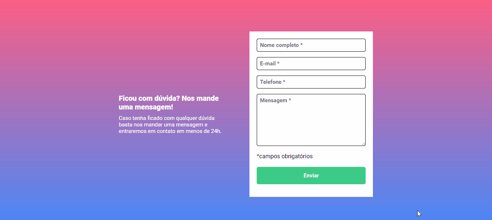

# Desafio JavaScript Intermediário
Essa é a resolução para o desafio de JavaScript intermediário, em que o objetivo era fazer a validação do formulário, proprosto no curso DevQuest. 

[]

## Desafios
A primeira forma que tentei usar para solucionar esse desafio foi adicionando um parágrafo através do próprio JS, para informar que os campos eram obrigatórios, mas lembrei das aulas sobre separar responsabilidades. Então optei por adicionar classes usando o JS.

## Tecnologias utilizadas
- HTML
- CSS
- JS